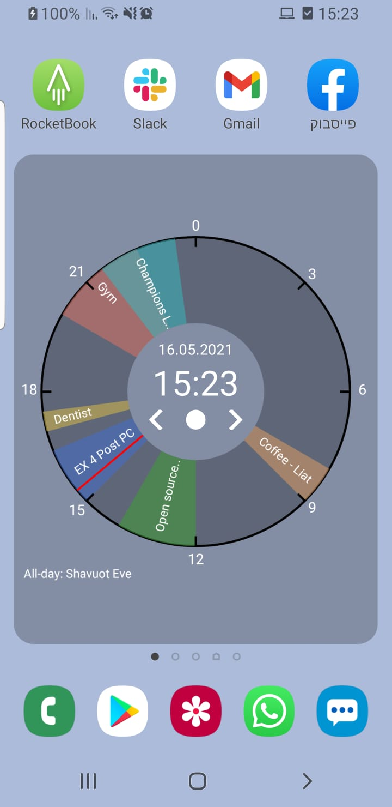
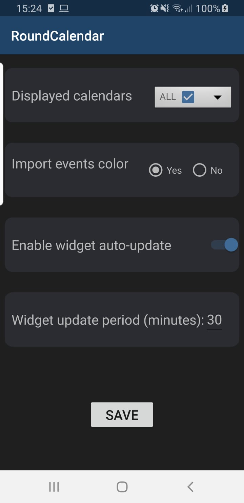

# Daily Calendar Clock Widget
An android widget designed for to visualize your google daily calendar in a round clock style visualization.
At any given moment, one look is enough for you to know your daily status.


<p align="center">
  
  
</p>


### Build
GUI way: build using Android Studio  
CLI way: ```./gradlew build```

### Install
-Install Android Studio : https://developer.android.com/studio/install \
-GUI way: run using Android Studio \
-CLI way: ```adb install ./app/build/outputs/apk/debug/app-debug.apk```


### Analogues
* [Sectograph](https://play.google.com/store/apps/details?id=prox.lab.calclock) - 24-hours view is paid
* [Daily Time Planner With Clock Widget](https://play.google.com/store/apps/details?id=com.sectograph.planner.time.clock.manager.reminder) - paid application
* [Foraday](https://play.google.com/store/apps/details?id=com.compscieddy.foradayapp) - no connection to Google Calendar
* [Slice Planner](https://play.google.com/store/apps/details?id=com.evopaper.sliceplanner&hl=ru) - no widget
* [CloudCal Calendar Agenda Planner Organizer To Do](https://play.google.com/store/apps/details?id=net.cloudcal.cal) - non-informative widget
